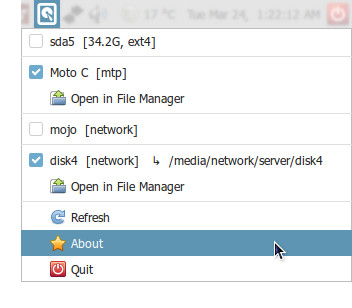

# disk_tray

A system tray applet for Linux that lets you mount, unmount, and browse all your disks, partitions, MTP devices, and network volumes from a single tray icon.

Built for MATE desktop but works on any GTK3/AppIndicator3-compatible environment (Xfce, Cinnamon, Unity, etc.).

---

## Features

- **All volume types** — internal partitions, removable drives, optical discs, MTP devices (phones, cameras), and network shares (SMB, NFS, SFTP, etc.)
- **Instant device events** — plug/unplug and mount/unmount changes appear immediately via `Gio.VolumeMonitor` signals, no restart needed
- **Click to mount/unmount** — each volume is a checkbox menu item; checked = mounted, click to toggle
- **Opens file manager on mount** — automatically opens the volume in your default file manager when mounted
- **Smart filtering** — hides swap, zram, `/home`, `/boot`, and other system partitions that don't need manual management
- **Desktop notifications** — brief mount/unmount notifications with appropriate device icons
- **Follows system theme** — uses standard GTK3 widgets and freedesktop icon names

---

## Screenshot

_A tray icon with a popup menu showing mounted and unmounted volumes with checkboxes, and action items with icons._



---

## Requirements

### Required

```bash
sudo apt install python3-gi gir1.2-appindicator3-0.1 gir1.2-gtk-3.0 udisks2
```

### Optional (for MTP and network volume support)

```bash
sudo apt install gvfs-backends
```

---

## Installation

```bash
git clone https://github.com/tmojo/disk_tray.git
cd disk_tray
chmod +x disk_tray.py
```

---

## Usage

```bash
python3 disk_tray.py &
```

A hard disk icon will appear in your system tray. Click it to show the menu.

### Menu layout

- **Volume rows** — one per detected volume; checkbox indicates mount state; click to mount or unmount
- **Open in File Manager** — appears below a mounted volume; opens it in your default file manager
- **Refresh** — manually trigger a device rescan
- **Quit** — exit the applet

---

## Autostart with MATE

Create `~/.config/autostart/disk_tray.desktop`:

```ini
[Desktop Entry]
Type=Application
Name=Disk Tray
Exec=python3 /path/to/disk_tray.py
Icon=drive-harddisk
StartupNotify=false
X-MATE-Autostart-enabled=true
```

Or add it via **System → Preferences → Personal → Startup Applications**.

---

## Configuration

Edit the constants near the top of `disk_tray.py`:

| Constant | Default | Description |
|---|---|---|
| `REFRESH_SECONDS` | `0` | How often to poll for block device state changes |
| `SKIP_FSTYPES` | _(set)_ | Filesystem types to always hide |
| `SKIP_MOUNTPOINTS` | _(set)_ | Mount points to always hide |

- Use **REFRESH_SECONDS = 5**, if mounted states are not being updated automatically by GVolumeMonitor
- Partitions identified as `/home` or swap in `/etc/fstab` are also hidden, regardless of their device name.

---

## How it works

- **Block devices** are discovered via `lsblk` in a background thread
- **MTP and network volumes** are discovered via `Gio.VolumeMonitor` on the GTK main thread
- **Device events** (plug, unplug, mount, unmount) trigger an immediate refresh via `Gio.VolumeMonitor` signals (`volume-added`, `volume-removed`, `mount-added`, `mount-removed`)
- **Mount/unmount** of block devices uses `udisksctl` (no sudo required); MTP and network volumes use `Gio.Volume.mount()` / `Gio.Mount.unmount_with_operation()`
- The menu is only rebuilt when the device list actually changes, preventing unnecessary redraws

---

## Known limitations

- GTK3 `CheckMenuItem` does not support displaying a custom image alongside the checkbox, so volume header rows show no icon. Action items (Open in File Manager, Refresh, Quit) do show icons.
- Network volume mount support depends on the relevant gvfs backend being installed (e.g. `gvfs-backends` for SMB/NFS/SFTP).

---

## License

MIT
